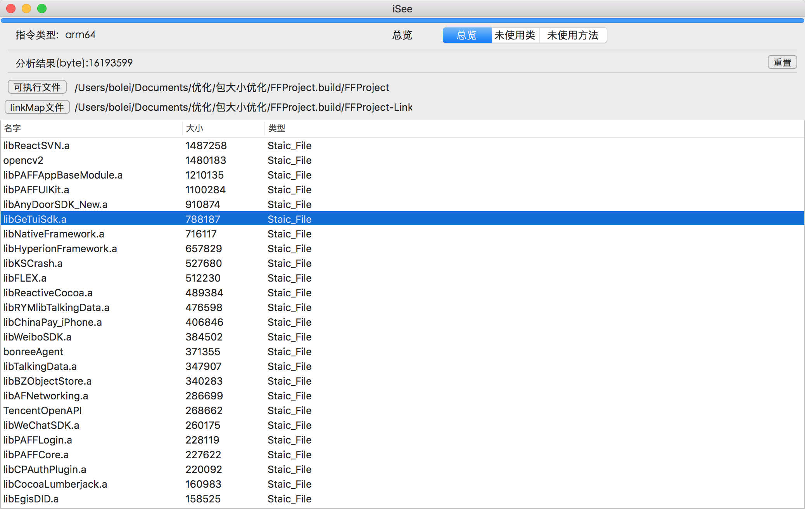
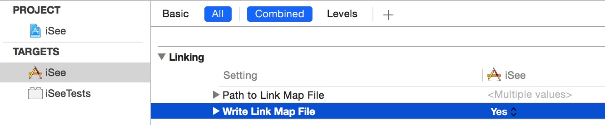
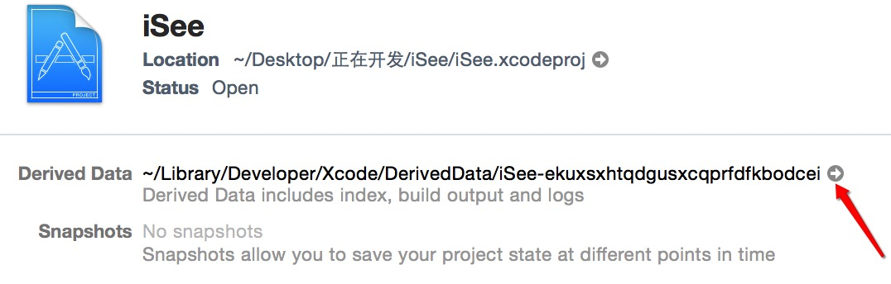
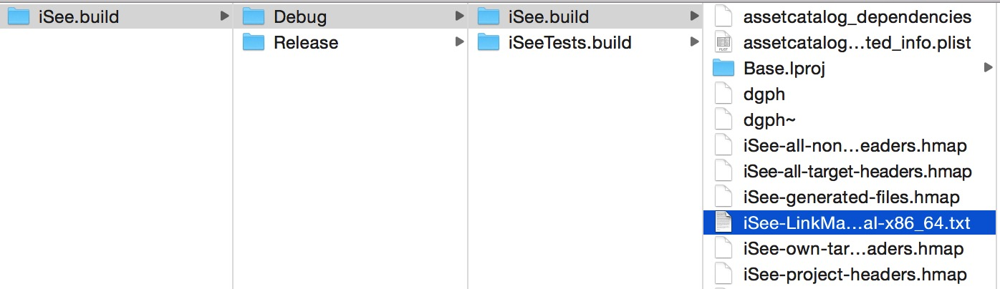
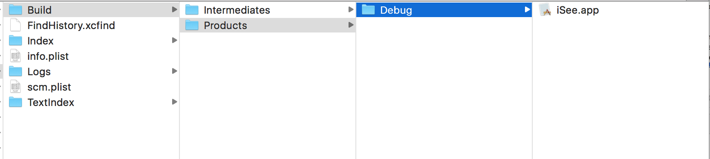

>> 导读
>> 为了方便对linkMap做解析，参考zyangSir的iSee工程，做了linkMap文件解析的工具，欢迎使用。
>> 

<!--more-->

# ios包大小分析工具iSee

## 简介

iSee是一款分析iOS可执行文件成分的工具，通过加载XCode在项目编译期间产生的linkMap文件，能够输出项目中每个类(包括第三方静态库)，在最终可执行文件中占用的长度信息。本工具根据zyangSir的代码做了部分修改。主要功能有：

1. 各个可执行文件占用大小
2. 可执行文件中，各个段占用的大小（包括方法+常量字符串等）
3. 未使用到的类
4. 未使用到的方法

## 使用方法

建议使用真机生成的文件测试，目前看对arm64架构支持最好。优先使用arm64相关文件检测。

### 导出生成linkmap文件

1. 在XCode编译选项中打开"WriteLinkMapFile"
     
    
2. 选择好真机/模拟器,Debug/Release。编译项目,进入项目的Derived Data目录  
     
    
3.  依次进入Build/Intermediates/项目名.build/  目录, 找到相应模式下的编译产物文件夹 
    
   
4. 可以看到一个名为 项目名-LinkMap-normal-CPU架构.txt的文件，在iSee中点击linkMap文件按钮，导入这个文件 

### 导出生成的可执行文件

1. 在上一步的Derived Data目录下,

    

   看到.app结尾的文件，邮件显示包内容，找到和工程名称一样的一个可执行文件，把这个文件copy到相关目录
   
   
2. 在iSee中点击可执行文件，导入刚才的文件
3. 之后程序会自动执行分析。

## 简单说明

1. 现在对arm64支持比较好，所以建议用这个格式测试。
2. 对于未使用方法和未使用类，使用otool工具来做辅助分析
3. 未使用方法和未使用类，有误报可能，主要误报的是一些实现协议的类，这一部分是动态使用的，所以静态分析不出来。

详细技术细节可以参考我的博客：
`https://dishibolei.github.io/`

